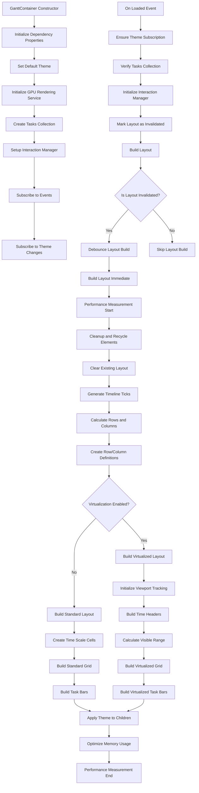
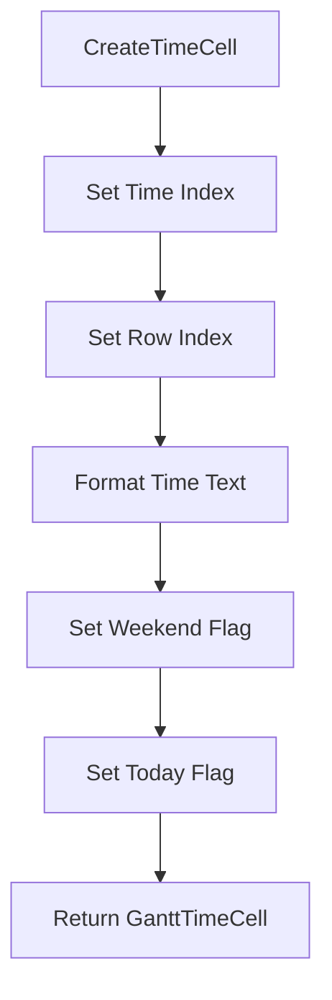
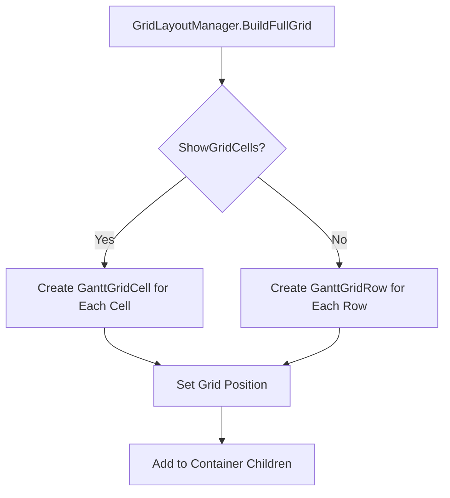
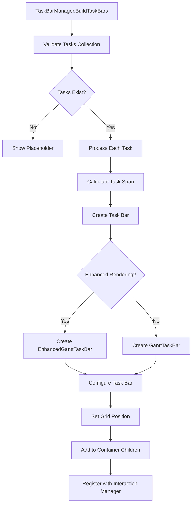

# GanttContainer Interface Construction Process Documentation

## Overview

This document details the interface construction process of the GanttContainer control in the GPM.Gantt library. GanttContainer is the core container of the Gantt chart component, responsible for coordinating the creation and layout of time scales, grids, and task bars.

## Construction Process Overview




## Detailed Construction Steps

### 1. Constructor Initialization Phase

#### 1.1 Dependency Property Initialization
GanttContainer initializes all dependency properties in the constructor, including:
- Time range properties (StartTime, EndTime)
- Task count property (TaskCount)
- Time unit property (TimeUnit)
- Grid display property (ShowGridCells)
- Theme property (Theme)
- Task collection property (Tasks)

#### 1.2 GPU Rendering Service Initialization
Initialize the GPU rendering service to support high-performance graphics rendering:
```csharp
_gpuRenderingService = InitializeGpuRenderingService();
```

#### 1.3 Task Collection Creation
Create ObservableCollection<GanttTask> to store task data and subscribe to collection change events.

#### 1.4 Interaction Manager Setup
Initialize GanttInteractionManager to handle user interactions, including:
- Task selection
- Drag operations
- Resize operations

#### 1.5 Event Subscription
Subscribe to necessary events:
- Loaded event: Processing after control loading is complete
- Unloaded event: Cleanup when the control is unloaded
- SizeChanged event: Relayout when control size changes
- ThemeChanged event: Reapply when theme changes

### 2. Loaded Event Handling Phase

When the GanttContainer control is fully loaded into the visual tree, the Loaded event handler is triggered:

#### 2.1 Theme Subscription Confirmation
Ensure the theme change event is properly subscribed.

#### 2.2 Task Collection Validation
Verify that the Tasks collection has been properly initialized, creating a new collection if not initialized.

#### 2.3 Interaction Manager Initialization
Associate the interaction manager with the current container.

#### 2.4 Layout Marked as Invalid
Mark the layout as needing rebuild, triggering the subsequent layout construction process.

### 3. Layout Construction Phase

#### 3.1 Layout Validity Check
Check if the layout needs to be rebuilt, controlled by the _isLayoutInvalidated flag.

#### 3.2 Debouncing Handling
Use the performance service's debouncing mechanism to avoid frequent layout reconstruction:
```csharp
_performanceService.DebounceOperation(BuildLayoutImmediate, delay, "layout");
```

#### 3.3 Immediate Layout Construction
Execute the actual layout construction process:

##### 3.3.1 Performance Measurement Start
Start performance measurement to monitor layout construction performance.

##### 3.3.2 Element Cleanup and Recycling
Clean up existing UI elements and return them to the element pool for reuse.

##### 3.3.3 Clear Existing Layout
Clear existing row, column definitions and child elements.

##### 3.3.4 Timeline Tick Generation
Generate timeline tick list for subsequent grid and task bar positioning.

##### 3.3.5 Row and Column Calculation
Calculate the number of rows and columns to create based on task count and timeline ticks.

##### 3.3.6 Row and Column Definition Creation
Create Grid row and column definitions:
- First row: Timeline row (using HeaderRowHeight)
- Other rows: Task rows (using TaskRowHeight)

### 4. Grid Layout Construction

#### 4.1 Virtualization Determination
Determine whether to enable virtualized rendering based on configuration:
```csharp
var shouldVirtualize = renderingConfig.EnableVirtualization && 
                      _virtualizationService.ShouldVirtualize(TaskCount, renderingConfig.MaxVisibleTasks);
```

#### 4.2 Standard Layout Construction (Non-virtualized)
If virtualization is not enabled, execute standard layout construction:

##### 4.2.1 Time Scale Cell Creation
Create GanttTimeCell objects for the timeline row:
- Set time index and text
- Mark weekends and today
- Set grid position (row 0)

##### 4.2.2 Standard Grid Construction
Call GridLayoutManager.BuildFullGrid to create the grid:
- Decide whether to create GanttGridRow or GanttGridCell based on ShowGridCells property
- GanttGridRow: Full row grid element
- GanttGridCell: Single grid cell

##### 4.2.3 Task Bar Construction
Call TaskBarManager.BuildTaskBars to create task bars:
- Iterate through task collection
- Calculate task span on the timeline
- Create GanttTaskBar or EnhancedGanttTaskBar
- Set grid position and span

#### 4.3 Virtualized Layout Construction
If virtualization is enabled, execute virtualized layout construction:

##### 4.3.1 Viewport Tracking Initialization
Initialize scroll viewport tracking to determine the visible area.

##### 4.3.2 Time Header Construction
Create timeline headers for the visible area.

##### 4.3.3 Visible Range Calculation
Calculate the visible row range based on the current viewport.

##### 4.3.4 Virtualized Grid Construction
Create only grid elements for the visible area.

##### 4.3.5 Virtualized Task Bar Construction
Create only task bars for the visible area.

### 5. Component Creation Detailed Process

#### 5.1 Time Scale Cell Creation Process




#### 5.2 Grid Element Creation Process




#### 5.3 Task Bar Creation Process




### 6. Post-processing Phase

#### 6.1 Theme Application
Apply the current theme to all child elements.

#### 6.2 Memory Optimization
Execute memory optimization if automatic memory optimization is enabled.

#### 6.3 Performance Measurement End
End performance measurement and record construction time.

## Performance Optimization Features

### Element Pooling
Use ElementPool to reuse UI elements, reducing garbage collection pressure.

### Virtualized Rendering
For large datasets, only render elements in the visible area.

### Debouncing Mechanism
Avoid frequent layout reconstruction operations.

### Caching Mechanism
Cache timeline tick and row height calculation results.

## Error Handling

The layout construction process includes complete exception handling mechanisms to ensure that even if errors occur, the application will not crash, and detailed error information will be recorded for debugging.

## Summary

The GanttContainer interface construction process is a highly optimized process that ensures good performance when handling large amounts of data through phased construction, virtualized rendering, element pooling, and other techniques. The entire process fully considers the WPF lifecycle and performance characteristics, providing flexible extension points to support different usage scenarios.